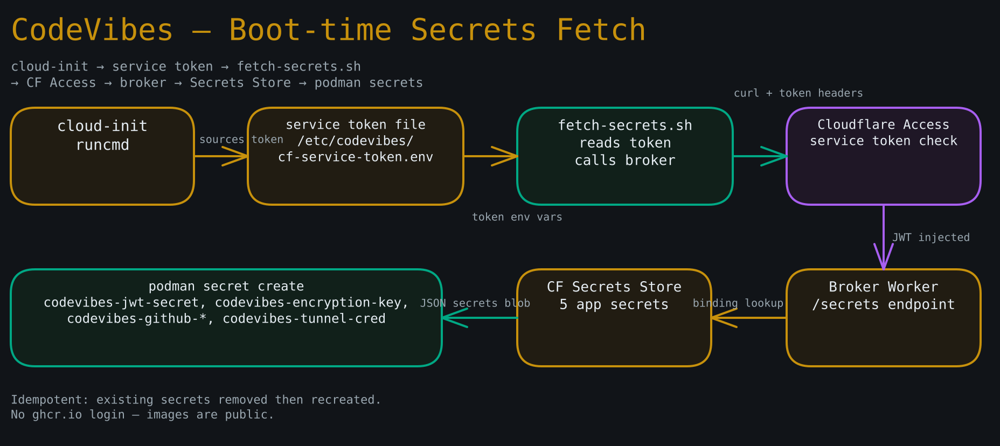

# Cloudflare Secrets Store + Broker Worker Setup

**Goal:** Enable Cloudflare Secrets Store on the `tjw.dev` account, populate the five app secrets (including `ENCRYPTION_KEY` — **generate once, never again**), deploy the `secrets-broker` Cloudflare Worker, wire it behind the Access service-token policy from `cloudflare-zerotrust.html`, and verify a full fetch.

**Prerequisites:**

- The `cloudflare-zerotrust.html` runbook is complete: Zero Trust is enabled, the `secrets.tjw.dev` service-token Access application exists, and you have both `CF_SERVICE_TOKEN_ID` and `CF_SERVICE_TOKEN_SECRET` in your password manager.
- Node.js and `wrangler` are available locally (`cd secrets-broker && npm install` satisfies this from the repo).
- The Cloudflare API token for wrangler has **Edit Workers** and **Secrets Store** permissions.

**Diagram — Boot-time secrets fetch path:**



---

## Part 1 — Use your account's default Secrets Store

> Cloudflare gives each account **one** Secrets Store (scoped to Workers) with up to **100 secrets** — you cannot create additional stores, and you do not need to. We use the default store and add our 5 secrets to it (well under the 100 limit).

**Step 1.** Log in to the [Cloudflare dashboard](https://dash.cloudflare.com). Navigate to **Workers & Pages > Secrets Store**. You should see the default store already present.

> If Secrets Store is not yet visible, it may be under **Beta** features. Enable it for your account; the default store appears once enabled.

**Step 2.** Record the **Store ID** of the default store — you will need it for every binding in Step 5/7. From the dashboard, copy the store ID shown on the store's page, or via wrangler:

```bash
npx wrangler secrets-store store list   # requires wrangler >=4; copy the default store's id
```

Do **not** try to create a second store (the account allows only one).

---

## Part 2 — Generate and store each secret

> **CRITICAL WARNING — `ENCRYPTION_KEY` is permanent and immutable.**
> It AES-encrypts every `github_token` and `deepseek_key` row in the SQLite database.
> If it ever changes, **all encrypted rows become permanently undecryptable** — silent,
> unrecoverable data loss. Generate it **exactly once**, store it here, and never
> regenerate or rotate it. Changing it requires a deliberate decrypt-all → re-encrypt
> migration; it is never a casual operation.

**Step 3.** Generate the secrets locally. Run these commands on your Mac and copy each value:

```bash
# JWT_SECRET — can be rotated (force-logs-out all sessions; low stakes)
openssl rand -base64 32

# ENCRYPTION_KEY — NEVER rotate; 64 hex chars (32 bytes) for AES-256-GCM.
# (encryption.ts reads .slice(0,64) as hex — a shorter key throws "Invalid key length".
#  The upstream .env.example saying "rand -hex 16 / 32 chars" is WRONG.)
openssl rand -hex 32
```

For `GITHUB_CLIENT_ID` and `GITHUB_CLIENT_SECRET`: these come from the GitHub OAuth App you register in the setup runbook. Complete the GitHub OAuth App step there first, then return here.

For `TUNNEL_CRED`: this is the tunnel credential JSON file produced when you create the Cloudflare Tunnel (see the setup runbook, Cloudflare section). It will look like `{"AccountTag":"...","TunnelID":"...","TunnelSecret":"..."}`.

**Step 4.** In the Cloudflare dashboard **Secrets Store** (the default store), add each secret:

| Secret name | Value | Notes |
|---|---|---|
| `codevibes-jwt-secret` | output of `openssl rand -base64 32` | Rotatable |
| `codevibes-encryption-key` | output of `openssl rand -hex 32` (64 hex chars) | **NEVER rotate** |
| `codevibes-github-client-id` | GitHub OAuth App Client ID | From GitHub |
| `codevibes-github-client-secret` | GitHub OAuth App Client Secret | From GitHub |
| `codevibes-tunnel-cred` | Tunnel credential JSON (one line) | From tunnel creation |

You should see five secrets listed in the store.

---

## Part 3 — Configure the Worker bindings

**Step 5.** Open `secrets-broker/wrangler.toml` in the repo. The `[[secrets_store_secrets]]` blocks are currently commented out (they require wrangler ≥ 4 with Secrets Store GA). Uncomment and fill in the `store_id` for each block:

```toml
[[secrets_store_secrets]]
binding = "JWT_SECRET"
store_id = "<your Store ID from Step 2>"
secret_name = "codevibes-jwt-secret"

[[secrets_store_secrets]]
binding = "ENCRYPTION_KEY"
store_id = "<your Store ID from Step 2>"
secret_name = "codevibes-encryption-key"

[[secrets_store_secrets]]
binding = "GITHUB_CLIENT_ID"
store_id = "<your Store ID from Step 2>"
secret_name = "codevibes-github-client-id"

[[secrets_store_secrets]]
binding = "GITHUB_CLIENT_SECRET"
store_id = "<your Store ID from Step 2>"
secret_name = "codevibes-github-client-secret"

[[secrets_store_secrets]]
binding = "TUNNEL_CRED"
store_id = "<your Store ID from Step 2>"
secret_name = "codevibes-tunnel-cred"
```

Also remove (or comment out) the `[vars]` test-stub block — it is only used by vitest and should not be present in the production deploy.

**Step 6.** Set the Worker route so `secrets.tjw.dev/secrets` maps to this Worker. In `wrangler.toml`, add:

```toml
routes = [
  { pattern = "secrets.tjw.dev/*", zone_name = "tjw.dev" }
]
```

---

## Part 4 — Deploy the Worker

**Step 7.** Deploy the Worker to production:

```bash
cd secrets-broker
npx wrangler deploy
```

You should see output like:

```
Uploaded codevibes-secrets-broker (N sec)
Published codevibes-secrets-broker (N sec)
  https://secrets.tjw.dev/secrets
```

**Step 8.** Verify the Access policy is enforced. From your terminal, attempt an unauthenticated request:

```bash
curl -si https://secrets.tjw.dev/secrets | head -5
```

You should see `HTTP/2 302` or `HTTP/2 403` — Cloudflare Access redirects or denies, not a 200. The Worker itself will never be reached without the service token.

---

## Part 5 — Test a full fetch with the service token

**Step 9.** Run a fetch using your service token credentials:

```bash
curl -fsS https://secrets.tjw.dev/secrets \
  -H "CF-Access-Client-Id: $CF_SERVICE_TOKEN_ID" \
  -H "CF-Access-Client-Secret: $CF_SERVICE_TOKEN_SECRET" \
  | jq 'keys'
```

You should see:

```json
[
  "ENCRYPTION_KEY",
  "GITHUB_CLIENT_ID",
  "GITHUB_CLIENT_SECRET",
  "JWT_SECRET",
  "TUNNEL_CRED"
]
```

All five keys present and non-empty confirms the Secrets Store bindings are wired correctly.

---

## Rotating a secret (future)

To rotate `JWT_SECRET` (safe rotation — only force-logs-out active sessions):

1. Generate a new value: `openssl rand -base64 32`.
2. Update `codevibes-jwt-secret` in the Secrets Store dashboard.
3. On the server, re-run `deploy/fetch-secrets.sh` (see recovery runbook) and restart the pod: `systemctl --user restart codevibes-pod`.

**Never** follow this process for `ENCRYPTION_KEY`. See the warning in Step 3.
