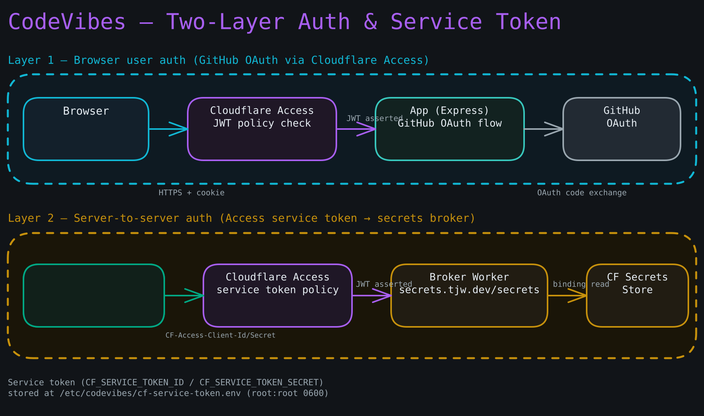

# Cloudflare Zero Trust Setup

**Goal:** Enable Cloudflare Access on the `tjw.dev` account for the first time, creating two Access applications: one gating `codevibes.tjw.dev` for human (Justin) access, and one gating `secrets.tjw.dev` for the secrets-broker service token.

**Prerequisites:**

- `tjw.dev` is already a Cloudflare zone with active DNS. Zero Trust / Access is not yet configured on the account.
- You are logged in to the Cloudflare dashboard as the account owner.
- GitHub is your identity provider of choice for the human application.

**Diagram — Two-layer auth and service token:**



---

## Part 1 — Enable Zero Trust on the account

**Step 1.** Open the [Cloudflare dashboard](https://dash.cloudflare.com) and navigate to **Zero Trust** in the left sidebar (or visit `https://one.dash.cloudflare.com`).

**Step 2.** If you have never used Zero Trust before, Cloudflare will prompt you to pick a team name. Enter a team name (for example `tjw`). This becomes your authentication domain: `tjw.cloudflareaccess.com`. Click **Next** and complete the free-tier setup flow.

You should see the Zero Trust dashboard home.

**Step 3.** Navigate to **Settings > Authentication > Login methods**. Add **GitHub** as an identity provider:

```
Provider type:   GitHub
Client ID:       <your GitHub OAuth App client ID for Cloudflare>
Client secret:   <secret>
```

Click **Save** and then **Test** — a browser tab should open, authenticate you via GitHub, and close. You should see "Your connection works."

---

## Part 2 — Human Access application for `codevibes.tjw.dev`

**Step 4.** Navigate to **Access > Applications** and click **Add an application**. Choose **Self-hosted**.

```
Application name:    CodeVibes
Session Duration:    30 days
Application domain:  codevibes.tjw.dev
```

Leave all other settings at defaults. Click **Next**.

**Step 5.** Create the policy that restricts access to Justin only:

```
Policy name:  Allow Justin
Action:       Allow
Selector:     Emails — contact.me@thejustinwalsh.com
```

Click **Next**, then **Add application**.

You should see `codevibes.tjw.dev` listed under **Access > Applications**.

**Checkpoint:** Open `https://codevibes.tjw.dev` in a browser. You should see the Cloudflare Access login page — not a 521 or 404. (The app is not yet deployed, so after authenticating you may see an error from the origin; that is expected at this stage.)

---

## Part 3 — Service-token Access application for `secrets.tjw.dev`

The secrets broker (`secrets.tjw.dev`) must accept **only** the machine service token, not human logins.

**Step 6.** Navigate to **Access > Applications** and click **Add an application**. Choose **Self-hosted**.

```
Application name:    CodeVibes Secrets Broker
Session Duration:    (irrelevant for service tokens; leave default)
Application domain:  secrets.tjw.dev
```

Click **Next**.

**Step 7.** Create a service-auth policy:

```
Policy name:  Broker service token only
Action:       Service Auth
Selector:     Service Token — (create a new service token — see Step 8)
```

Click **Next**, then **Add application**.

**Step 8.** Navigate to **Access > Service Auth > Service Tokens** and click **Create Service Token**:

```
Token name:  codevibes-server
Expiration:  Non-expiring  (or set a long rotation interval)
```

Click **Generate token**. You will see:

```
Client ID:      <CF_SERVICE_TOKEN_ID>
Client Secret:  <CF_SERVICE_TOKEN_SECRET>
```

**Copy both values immediately — the secret is shown only once.** Store them in your password manager. You will supply them to `deploy/gen-cloud-init.sh` as `CF_SERVICE_TOKEN_ID` and `CF_SERVICE_TOKEN_SECRET`.

**Step 9.** Return to the `secrets.tjw.dev` Access application and edit the policy to reference the service token you just created. Save.

**Checkpoint:** Confirm the policy shows the `codevibes-server` service token as the only allowed selector.

---

## Part 4 — DNS entries

**Step 10.** In the Cloudflare DNS dashboard for `tjw.dev`, verify (or add) CNAME records:

```
codevibes.tjw.dev  →  (the tunnel will set this; Cloudflare Tunnel creates it automatically when you run the tunnel)
secrets.tjw.dev    →  <your Worker's *.workers.dev hostname OR a CNAME once deployed>
```

The Cloudflare Tunnel for `codevibes.tjw.dev` creates its own DNS entry when configured (see the setup runbook). For `secrets.tjw.dev`, deploy the Worker first (see `cloudflare-secrets.html`) and use the Worker route setting there.

---

## Revocation — kill switch for a lost or compromised device

If a device is compromised or a session needs to be killed immediately:

1. Navigate to **Zero Trust > Access > Sessions** and revoke Justin's active session for `codevibes.tjw.dev`.
2. If the service token is compromised, navigate to **Access > Service Auth > Service Tokens**, find `codevibes-server`, and click **Revoke**. Re-provision with a new token and re-run `deploy/fetch-secrets.sh` on the server.

You should see the revocation reflected immediately in the dashboard. Revoked sessions will be denied on the next Access check.
