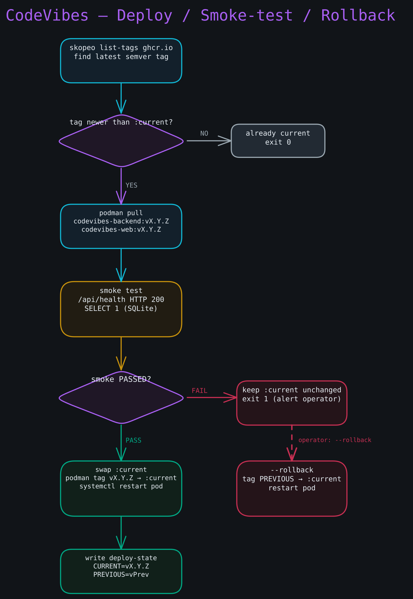

# Recovery Runbook

**Goal:** Restore CodeVibes to a working state when the automated smoke-test + rollback did not save you. Steps are ordered from least invasive to most; work through them top to bottom and stop when the system is healthy.

**Diagram — Deploy, smoke-test, and rollback decision flow:**



---

## Step 1 — Triage: determine what is broken

SSH into the server. Always start from the `codevibes` user to see systemd user units:

```bash
ssh root@<server-IP>
su - codevibes
export XDG_RUNTIME_DIR=/run/user/$(id -u)
```

Check overall pod status:

```bash
systemctl --user status codevibes-pod
```

List containers and their states:

```bash
podman ps -a --pod
```

You should see three containers — `codevibes-backend`, `codevibes-web`, `codevibes-cloudflared` — all in the `codevibes` pod. Any container with `Exited` or `Error` is the likely culprit.

Read the failing unit's logs:

```bash
# Replace <unit> with the failing container name, e.g. codevibes-backend
journalctl --user -u <unit> -n 100
```

Run the smoke test manually to confirm whether the backend is healthy:

```bash
curl -sf http://localhost:80/api/health && echo "OK" || echo "FAIL"
```

---

## Step 2 — Manual rollback to the last-known-good tag

Use this when a recent deploy broke something that the automatic smoke test did not catch (for example: a regression visible only after a full login, or a subtle DB migration issue).

**Find the state file on the data volume:**

```bash
cat /mnt/codevibes-data/deploy-state
```

You should see:

```
CURRENT=v1.0.3
PREVIOUS=v1.0.2
```

**Run the rollback script:**

```bash
bash ~/codevibes/deploy/deploy.sh --rollback
```

You should see:

```
[deploy] rolling back to v1.0.2
[deploy] rollback complete
```

**Verify the pod restarted on the previous tag:**

```bash
systemctl --user status codevibes-pod
curl -sf http://localhost:80/api/health && echo "OK"
```

If the pod is healthy, verify through the browser: open `https://codevibes.tjw.dev` and confirm the app loads and you can log in.

**If no previous tag exists** (first deploy, or state file is absent), find available tags from ghcr:

```bash
# List available tags (requires skopeo or curl with ghcr API)
curl -s "https://ghcr.io/v2/thejustinwalsh/codevibes-backend/tags/list" | jq '.tags'
```

Then retarget manually to a known-good tag:

```bash
# Replace v1.0.1 with the tag you want to pin to
podman pull ghcr.io/thejustinwalsh/codevibes-backend:v1.0.1
podman pull ghcr.io/thejustinwalsh/codevibes-web:v1.0.1
podman tag ghcr.io/thejustinwalsh/codevibes-backend:v1.0.1 localhost/codevibes-backend:current
podman tag ghcr.io/thejustinwalsh/codevibes-web:v1.0.1 localhost/codevibes-web:current
systemctl --user daemon-reload
systemctl --user restart codevibes-pod
```

---

## Step 3 — Re-fetch secrets

Use this when the pod is failing with authentication errors, undefined environment variables, or `podman secret` references not resolving — especially after a reprovision or if the Secrets Store was updated.

**Verify which secrets exist:**

```bash
podman secret ls
```

You should see five secrets:

```
codevibes-jwt-secret
codevibes-encryption-key
codevibes-github-client-id
codevibes-github-client-secret
codevibes-tunnel-cred
```

**Re-run fetch-secrets.sh:**

```bash
# The service token env is in the root-owned file; source it as root then su
sudo bash -c '. /etc/codevibes/cf-service-token.env; su - codevibes -c "
  export XDG_RUNTIME_DIR=/run/user/\$(id -u)
  set -a
  . /etc/codevibes/cf-service-token.env
  ~/codevibes/deploy/fetch-secrets.sh
"'
```

You should see:

```
[fetch-secrets] podman secrets created
```

**Restart the pod to pick up the refreshed secrets:**

```bash
systemctl --user restart codevibes-pod
systemctl --user status codevibes-pod
```

---

## Step 4 — Volume reattach after box replacement

Use this when the VM is dead (hardware failure, accidentally deleted) and you need to reattach the data volume to a fresh server. The volume contains the SQLite DB and backup files.

**Step 4a.** In the [Hetzner Cloud Console](https://console.hetzner.cloud), detach the volume from the old server (if it still exists). Navigate to **Volumes > codevibes-data** and click **Detach**.

**Step 4b.** Create a new CX22 server following **Section 3 of the setup runbook** (render cloud-init, create server). When creating the server, **attach the existing volume `codevibes-data`** in the volume section — do not create a new one.

Cloud-init will detect that the volume already has a filesystem:

```bash
# cloud-init runs: blkid "$DEV" — succeeds on an existing FS, so mkfs.ext4 is skipped
```

You should see in `/var/log/cloud-init-output.log`:

```
# blkid output (non-empty) → no mkfs, volume mounted as-is
```

**Step 4c.** After cloud-init completes, verify the DB is intact:

```bash
su - codevibes
sqlite3 /mnt/codevibes-data/codevibes.db "SELECT count(*) FROM users;"
```

You should see a non-zero row count matching your previous data.

**Step 4d.** Verify the pod is healthy with the reattached data:

```bash
export XDG_RUNTIME_DIR=/run/user/$(id -u)
curl -sf http://localhost:80/api/health && echo "OK"
```

---

## Step 5 — Restore from backup

Use this when the live DB is corrupt (not merely a failed deploy). The nightly backup timer writes timestamped `.db` files to `/mnt/codevibes-data/backups/` and retains the last 7.

**Step 5a.** Stop the backend to prevent writes to the corrupt DB:

```bash
export XDG_RUNTIME_DIR=/run/user/$(id -u)
systemctl --user stop codevibes-backend
```

**Step 5b.** List available backups:

```bash
ls -lht /mnt/codevibes-data/backups/
```

You should see files named like `codevibes-20260619T033001Z.db`. Pick the most recent one that predates the corruption.

**Step 5c.** Restore the backup:

```bash
cp /mnt/codevibes-data/backups/codevibes-<TIMESTAMP>.db /mnt/codevibes-data/codevibes.db
```

**Step 5d.** Verify the restored file is not corrupt:

```bash
sqlite3 /mnt/codevibes-data/codevibes.db "PRAGMA integrity_check;"
```

You should see `ok`.

**Step 5e.** Restart the backend:

```bash
systemctl --user start codevibes-backend
systemctl --user status codevibes-backend
curl -sf http://localhost:80/api/health && echo "OK"
```

Any data written between the backup timestamp and the time of corruption is lost. Sessions will be valid only for users who authenticated before the backup; others will need to re-login and re-enter their DeepSeek key.

---

## Step 6 — Escalation: full teardown and rebuild

Use this when nothing above restores the system. The volume preserves your data through a full rebuild.

1. Follow **Step 4** (volume reattach) — detach the volume, spin a fresh server, attach the volume.
2. Treat the new server as a first deploy: follow the full **setup runbook**.
3. After cloud-init completes on the new box, verify as in Step 4c and Step 4d.
4. If the data volume itself is corrupted beyond repair, restore from backup (Step 5) after cloud-init mounts the volume.

---

## Quick-reference commands

```bash
# Pod status
systemctl --user status codevibes-pod

# Live logs for all pod units
journalctl --user -u 'codevibes-*' -f

# Rollback to last-known-good
bash ~/codevibes/deploy/deploy.sh --rollback

# Re-fetch secrets from Cloudflare broker
~/codevibes/deploy/fetch-secrets.sh   # (with CF_SERVICE_TOKEN_* in env)

# List podman secrets
podman secret ls

# List backup files
ls -lht /mnt/codevibes-data/backups/

# SQLite integrity check
sqlite3 /mnt/codevibes-data/codevibes.db "PRAGMA integrity_check;"
```
