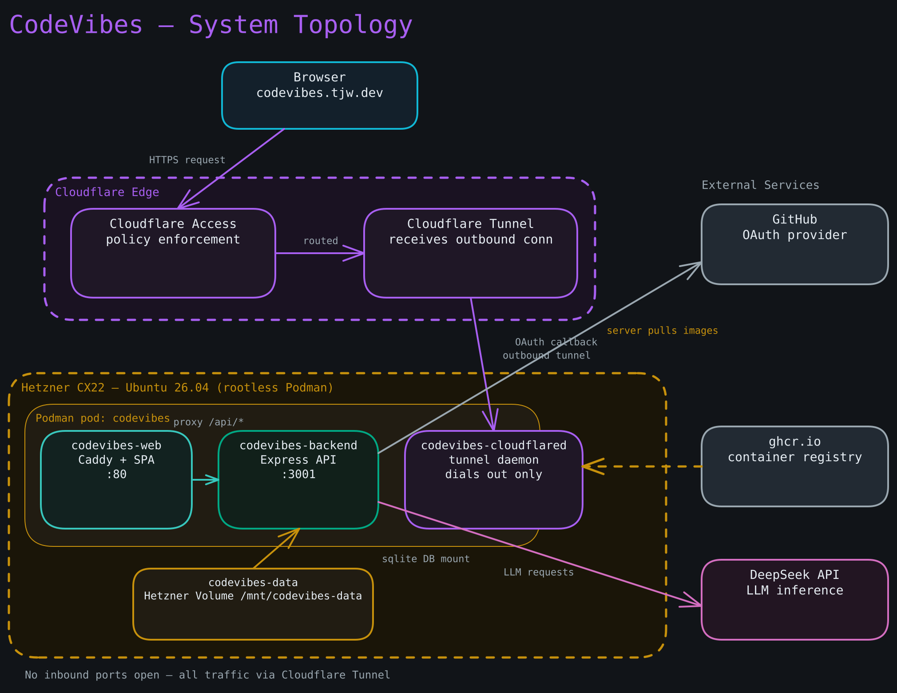

# End-to-End First Deploy — Setup Runbook

**Goal:** Take `codevibes.tjw.dev` from nothing to a running, Access-gated production deployment on Hetzner, with CI-built images, Cloudflare Tunnel ingress, and Cloudflare-brokered secrets. Complete these sections **in order** — each depends on the prior one.

**Prerequisites:**

- macOS with Homebrew, `git`, `gh` CLI, `jq`, `node` (for wrangler) installed.
- A Cloudflare account with `tjw.dev` as an active zone (DNS already managed by Cloudflare).
- A Hetzner Cloud account with a static home IP address for SSH access.
- The fork `thejustinwalsh/codevibes` exists (or will be created in Step 1).

**Diagram — Full system topology:**



---

## Section 1 — GitHub: fork, OAuth App, and package visibility

### Step 1 — Create the public fork

If you have not already forked `danish296/codevibes` to `thejustinwalsh/codevibes`, do so on GitHub. Ensure the fork is **public** — this forces the no-secrets-in-image discipline (anyone can pull the images, so secrets must never be baked in).

Create the `production` branch if it does not exist:

```bash
git clone https://github.com/thejustinwalsh/codevibes.git
cd codevibes
git checkout -b production
git push -u origin production
```

### Step 2 — Register the GitHub OAuth App

Go to **GitHub Settings > Developer settings > OAuth Apps > New OAuth App**:

```
Application name:  CodeVibes (production)
Homepage URL:      https://codevibes.tjw.dev
Authorization callback URL: https://codevibes.tjw.dev/api/auth/callback
```

Click **Register application**. On the next page:

1. Copy the **Client ID** → this is `GITHUB_CLIENT_ID`.
2. Click **Generate a new client secret** → copy the value → this is `GITHUB_CLIENT_SECRET`.

These two values go into the Cloudflare Secrets Store (see Section 2, `cloudflare-secrets.html`).

### Step 3 — Enable GitHub Actions and verify workflows

Push the `production` branch with the `.github/workflows/` files in place. Navigate to `https://github.com/thejustinwalsh/codevibes/actions` and confirm both workflows appear:

- `sync-upstream` — scheduled daily; trigger manually once to verify it runs.
- `build-images` — triggered on release; you will trigger it in Step 4.

```bash
# Trigger a manual sync to confirm the workflow reaches the correct upstream
gh workflow run sync-upstream --repo thejustinwalsh/codevibes
```

You should see the workflow run start and complete successfully (or fail gracefully with "already have tag").

### Step 4 — Trigger the first image build and set package visibility to public

Create a release/tag matching the upstream version (e.g., `v1.0.2`) on your fork:

```bash
gh release create v1.0.2 --repo thejustinwalsh/codevibes \
  --title "v1.0.2" --notes "Initial production build"
```

Wait for the `build-images` workflow to complete. Navigate to:

```
https://github.com/thejustinwalsh?tab=packages
```

You should see `codevibes-backend` and `codevibes-web` listed. For each package:

1. Click the package name.
2. Click **Package settings**.
3. Under **Danger Zone**, change visibility to **Public**.

You should see the packages accessible anonymously (no login required to pull). Verify:

```bash
podman pull ghcr.io/thejustinwalsh/codevibes-backend:v1.0.2
podman pull ghcr.io/thejustinwalsh/codevibes-web:v1.0.2
```

Both should pull without prompting for credentials.

---

## Section 2 — Cloudflare: Zero Trust, Secrets, Tunnel, DNS

**Complete these two runbooks in full before continuing:**

1. **`cloudflare-zerotrust.html`** — Enable Access; create the human application for `codevibes.tjw.dev` (Justin only, 30-day session) and the service-token application for `secrets.tjw.dev`; generate and record the service token.

2. **`cloudflare-secrets.html`** — Enable Secrets Store; populate all five secrets (especially generate `ENCRYPTION_KEY` **exactly once**); deploy the broker Worker; verify a fetch.

Once both are complete, you have:
- `CF_SERVICE_TOKEN_ID` and `CF_SERVICE_TOKEN_SECRET` in your password manager.
- Five secrets live in the Cloudflare Secrets Store.
- `secrets.tjw.dev/secrets` returning the correct JSON when called with the service token.

### Step 5 — Create the Cloudflare Tunnel

Install `cloudflared` locally if not already present:

```bash
brew install cloudflared
```

Log in:

```bash
cloudflared tunnel login
```

Create the tunnel:

```bash
cloudflared tunnel create codevibes
```

You should see output like:

```
Created tunnel codevibes with id <TUNNEL_UUID>
```

Note the **Tunnel UUID** — this is `TUNNEL_ID` in `deploy/config.env`.

The tunnel credential file is created at `~/.cloudflared/<TUNNEL_UUID>.json`. This file's **contents** (the JSON) become `TUNNEL_CRED` in the Cloudflare Secrets Store. If you have not already added it:

```bash
cat ~/.cloudflared/<TUNNEL_UUID>.json
```

Paste the output into the `codevibes-tunnel-cred` entry in Secrets Store.

### Step 6 — Update `deploy/config.env` with the tunnel UUID

Edit `deploy/config.env` in the repo and replace `REPLACE_WITH_TUNNEL_UUID` with the real UUID:

```bash
# In deploy/config.env:
TUNNEL_ID=<your-TUNNEL-UUID>
```

Commit this change to the `production` branch:

```bash
git add deploy/config.env
git commit -m "config: fill tunnel UUID"
git push origin production
```

### Step 7 — DNS for `codevibes.tjw.dev`

Create the Cloudflare Tunnel DNS route (this points the hostname at the tunnel):

```bash
cloudflared tunnel route dns codevibes codevibes.tjw.dev
```

You should see:

```
Added CNAME codevibes.tjw.dev which will route to this tunnel tunnelID=<UUID>
```

Verify in the Cloudflare DNS dashboard that `codevibes.tjw.dev` now has a CNAME to `<UUID>.cfargotunnel.com` with the proxy (orange cloud) enabled.

---

## Section 3 — Hetzner: Volume, server, cloud-init

### Step 8 — Create the Hetzner Volume

In the [Hetzner Cloud Console](https://console.hetzner.cloud):

1. Select your project (or create one).
2. Navigate to **Volumes** and click **Create Volume**.

```
Size:       10 GB (minimum; the DB is megabytes)
Location:   Falkenstein (fsn1)
Name:       codevibes-data
```

Note the Volume ID — you will attach it to the server in the next step.

### Step 9 — Render the cloud-init document

Back on your Mac, create `deploy/cloud-init.vars` (this file is git-ignored):

```bash
cat > deploy/cloud-init.vars <<'EOF'
CF_SERVICE_TOKEN_ID=<your CF_SERVICE_TOKEN_ID>
CF_SERVICE_TOKEN_SECRET=<your CF_SERVICE_TOKEN_SECRET>
FORK_REPO=thejustinwalsh/codevibes
TUNNEL_ID=<your TUNNEL_UUID>
EOF
```

Render the cloud-init document:

```bash
bash deploy/gen-cloud-init.sh deploy/cloud-init.vars /tmp/cloud-init-codevibes.yaml
```

You should see:

```
gen-cloud-init: wrote /tmp/cloud-init-codevibes.yaml (XXXX bytes)
```

Confirm it is under 32 KiB and contains no `__placeholder__` tokens:

```bash
wc -c /tmp/cloud-init-codevibes.yaml     # must be < 32768
grep "__" /tmp/cloud-init-codevibes.yaml  # must produce no output
```

### Step 10 — Create the CX22 server with cloud-init

In the Hetzner Cloud Console, click **Create Server**:

```
Location:     Falkenstein (fsn1)
Image:        Ubuntu 26.04
Type:         CX22  (2 vCPU, 4 GB RAM, 40 GB NVMe)
SSH keys:     add your public key
Cloud config: paste the contents of /tmp/cloud-init-codevibes.yaml
Volumes:      attach codevibes-data (created in Step 8)
Firewall:     create a new firewall — allow TCP 22 from <your static home IP> only; deny all else
```

Click **Create & Buy now**. The server will boot and cloud-init will run.

---

## Section 4 — First deploy and verification

### Step 11 — Watch cloud-init complete

SSH into the server (once it is up, usually within 60–90 seconds):

```bash
ssh root@<server-IP>
```

Watch cloud-init progress:

```bash
tail -f /var/log/cloud-init-output.log
```

Cloud-init is complete when you see:

```
Cloud-init v. X.X finished ...
```

This may take 3–5 minutes while packages install and the repo is cloned.

### Step 12 — Verify the pod is running

Switch to the deploy user:

```bash
su - codevibes
export XDG_RUNTIME_DIR=/run/user/$(id -u)
systemctl --user status codevibes-pod
```

You should see all three containers (`codevibes-backend`, `codevibes-web`, `codevibes-cloudflared`) listed as **active (running)**.

Also check:

```bash
podman ps --pod
```

You should see three containers in the `codevibes` pod.

### Step 13 — Verify the smoke test manually

```bash
# Health check
curl -sf http://localhost:80/api/health

# SPA index
curl -sf http://localhost:80/ | grep "<title"
```

You should see a 200 JSON response from `/api/health` and the SPA HTML title from `/`.

### Step 14 — Verify through Cloudflare Access

Open `https://codevibes.tjw.dev` in a browser. You should see the Cloudflare Access login page. Log in with your GitHub identity. You should see the CodeVibes dashboard — not a 521 or tunnel error.

### Step 15 — GitHub OAuth login + private-repo analysis

Click **Login with GitHub** inside the app. Complete the OAuth flow. After login, try analyzing a private GitHub repository. You should see the analysis stream back.

You should see results, confirming the full stack: Access → Caddy → backend → GitHub API → DeepSeek → response.

---

## Troubleshooting quick reference

| Symptom | Check |
|---|---|
| Cloud-init hangs | `journalctl -u cloud-init` on the server |
| Pod not starting | `systemctl --user status codevibes-pod` as `codevibes` user |
| Tunnel not connecting | `journalctl --user -u codevibes-cloudflared` |
| Secrets missing | Run `podman secret ls` and re-run `deploy/fetch-secrets.sh` if any are absent |
| Access blocking legitimate login | Verify email in the Access policy matches your GitHub-linked email |
